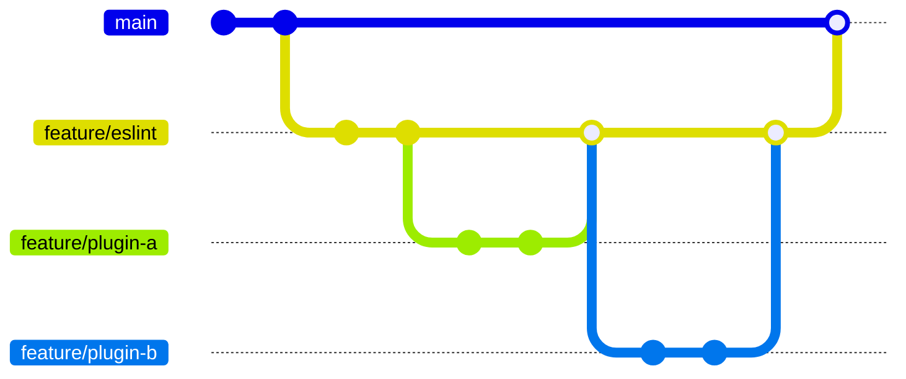

# tricklets.github.io

## 概要
tricklets project


---- ---- ---- ----

本ドキュメントは、開発や運用に携わるすべてのメンバーが参照し、必要に応じて誰でも改訂できるものです。  
口頭やチャットなどで説明や議論された内容で本ドキュメントに記載がないものは、追記してください。

説明する側は、既に記載されているポイントを示しながら説明し、記載がない場合は内容を追記するようにします。  
説明を受ける側は、本ドキュメントに該当の記載があるかを確認し、ない場合は追記するようにします。  
特に説明を受ける側は、理解を深めるためのアウトプットとして記述を行うことで、説明者との相互理解や他のメンバーへの共有にも貢献できます。記述を積極的に行いましょう。

うまく整理や記述ポイントが定まらなくても、まずは本ドキュメントに書くことを優先してください。  
内容や配置の修正は、気づいた人が適宜行い補っていくことで構いません。  
まずは「書かれていない状態」を避けることを心がけましょう。

本ドキュメントの改訂はプルリクエストを作成し、多くのレビューアーを加て参照や議論が行われるようにします。

---- ---- ---- ----


## 開発
### ローカル開発環境のセットアップ
本プロジェクトはブランチ方式の開発を採用しています。  

開発者はリポジトリへのアクセス権を付与され、ブランチを作成してプッシュします。  
ブランチからプルリクエストを作成し、レビューを経て `main` ブランチへマージされます。  

プルリクエスト以外の目的でリポジトリにブランチを作成しないでください。  
一時的に作成したブランチは作成者が管理し、不要になった時点で必ず作成者が削除します。  

Issues は、起票者以外のメンバーが見ても実装や対応の可否を判断できるレベルで記述してください。  
プロダクトの共有資産として起票・管理を行い、メモや個人的な内容はリポジトリには含めず、個人で管理してください。  
また Issues 以外にチケット・トラックのシステムが導入される場合は Issues は使用しないでください。

開発環境は Node.js と pnpm を使用します。  
Node.js は本プロジェクトで指定されたバージョンを使用してください。  
使用するバージョンは `package.json` の `engines` および `devEngines` フィールドで定義されます。  
通常は `devEngines` フィールドの定義により、自動的に適切なバージョンが設定されます。  
pnpm は Node.js の Corepack と `package.json` の `packageManager` により管理されるため、別途セットアップは不要です。  
- [Node.js](https://nodejs.org/)
- [pnpm](https://pnpm.io/)

Node.js のセットアップが完了したら、リポジトリをクローンしたディレクトリで以下のコマンドを実行します。
```shell-session
pnpm run setup
```

### コミット
1つのコミットは単機能でシンプルにします。  

たとえば1つの機能を実現するために依存パッケージの追加が必要な場合、  
パッケージの追加と機能の実装は別々にコミットします。  
実装機能に加えて共通処理などが必要な場合も、共通部分を分離して別コミットにするのが望ましい形です。  

プルリクエストは `Merge Commit` でマージされます。  
コミットログはすべて残されて履歴に積まれるため適切な単位のコミット分割が重要です。  

開発者自身の作業ログとしてのコミットは、原則としてローカルのみで扱い、  
GitHub へはプッシュしないようにしてください。  
プッシュはシステムの変更履歴として意味のある単位で構成します。  
※ コミットとプッシュは役割が異なります。コミット＝プッシュとはせず、不要な履歴を GitHub へ上げないようにします。  
※ GitHub へプッシュすると CI/CD が動作します。不要な CI/CD は回さないようにします。  

「進捗を見せるため」「ローカルにしかない状態を避けるため」などの理由で、  
作業途中のコミットをそのままプッシュする習慣（いわゆる WIP プッシュ）は避けてください。  
WIP の頻繁なプッシュは履歴をノイズで埋め、レビュー効率や CI/CD の品質にも悪影響を与えます。  
また「動いた」の積み重ねだけで適切なコードの分割やリファクタリングの妨げにもなります。  
必要に応じて進捗を共有したい場合は、後述の `wip/` ブランチを利用します。  

コミットメッセージには以下の接頭辞を付け、変更内容の目的がわかるようにします。  
差分の説明ではなく、「何のための変更か（目的・理由）」を簡潔に示してください。  
例：`build: configure basic project settings`  
※ 「〇〇ファイルを追加した」「○○を実装した」はコードを見ればわかります。なぜ追加したのかはコードからわかりません。そのなぜの情報が重要なのです。  

| コミット接頭辞   | 説明                                       |
|:-----------------|:-------------------------------------------|
| feature:         | 新しい機能の追加                           |
| enhance:         | 既存の提供済み機能に対する変更や拡張       |
| security:        | セキュリティに関する修正や追加             |
| fix:             | 既存の提供済み機能の報告された不具合の修正 |
| deprecated:      | 既存の提供済み機能を廃止のための非推奨化   |
| docs:            | ドキュメントの追加や修正                   |
| refactor:        | 内部バグ修正や機能の追加ではない変更       |
| testing:         | テストの追加や既存のテストの修正           |
| build:           | プロジェクトのビルドに関する変更           |
| chore(deps):     | 外部依存モジュールに関する変更             |
| chore(deps-dev): | 開発用の外部依存モジュールに関する変更     |

既存機能の変更における分類の考え方は以下の通りです。  
※ 「不具合の修正＝fix」と短絡的に扱わず、目的と影響範囲で判断します。  
※ 品質改善のための変更は不具合レポートやインシデント統計には含めないため fix ではありません。  
- fix: ユーザーに対して機能が提供できない状態の修正。明確な不具合・バグとして報告を受けたもの。  
- enhance: 提供済み機能の拡張。開発者が発見した不具合のような挙動でも、ユーザーへの提供が停止していない場合はここに含めます。  
- refactor: 外部仕様に影響しない内部コードの改善。機能変更を伴わない構造的な修正。  

変更内容は以下のルールに従ってブランチを作成し、  
プッシュ後にプルリクエストを送って `main` ブランチへ反映します。  
- ブランチ名はコミットメッセージの接頭辞で始めます
- チケット番号を小文字で含めます

ブランチ名の形式は以下の通りです。  
`<prefix>/<ticket>/<name>`  
※ ブランチ名の接頭辞は必須です。接頭辞なしのフラットなブランチ作成・プッシュは禁止します。  
※ フラットにブランチを配置すると、ブランチ一覧が長くなり管理が難しくなる問題を避けるためです。  
※ チケットが存在しない場合は後付けでもよいのでチケットを作成し、そのチケット番号をブランチ名に使用します。  

開発者間でコードの共有や確認などのために一時的に GitHub へプッシュする場合は、`wip/` で始まるブランチを使用します。  
`wip/` ブランチでは CI/CD によるビルドやテストは実行されません。  
また利用目的を達したら早急に削除し、長期にわたる不要な wip ブランチを残さないようにします。  

複雑だったり大きな機能の場合、あるいは同じ個所を連続的に変更していくような開発している場合は、
中間ブランチを作り、そこへ単機能の小さなプルリクエストを出します。  

たとえば ESLint の導入では、ESLint 本体の導入と基本的な設定、各種 Plugin の導入と設定があります。  

これは `build/eslint` などのような中間ブランチを作ります。  
その `build/eslint` から派生した `build/eslint-plugin-typescript` を作り、Plugin を導入します。  
そして `build/eslint-plugin-typescript` から `build/eslint` へのプルリクエストでマージ。  
同様に他の Plugin などを `build/eslint` へプルリクエストでマージしていき、
すべてが `build/eslint` へマージし終わったら `build/eslint` から `main` へマージします。
最後のマージはレビュー済みの集まりですが記録のためにプルリクエストを作成します。  

さらには、その中間ブランチをまとめるためのロードマップ的な Issues を起票し、
すべてを満たしたら中間ブランチと一緒にクローズするとなお良いです。  



### 実装方針
#### コーディング規約
- ディレクトリとファイルは小文字の英数字で原則としてケバブケースで命名します
- 文字コードは UTF-8 とします
- ファイルの末尾は改行コード(空行)とします
- 行の末尾のスペースは削除します(空行は改行のみとしインデントのスペースなどは含めません)
- インデントは半角 2 スペースとします
- 名前空間を意識し上位の名前空間で認識できる名称は省略しなるべく１ワードのシンプルな命名をします
- コミットログおよびプルリクエストのタイトルは英語表記とします
- 時間を表す数値は原則として時分秒などの単位の数式で記述します (e.g. `24 * 60 * 60 * 1000`)
- 同じような処理は同じように実装し差分が発生しないようにします (必要に応じて過去実装側をリファクタリングします)

#### ログ出力
- 公開されている関数は入るところで関数名と引数の INFO ログ出力します(必須)  
- 関数が終わるところで関数名を、処理結果や戻り値がある場合は引数にして DEBUG ログ出力します(推奨)  
- AWS Lambda のハンドラーはコンテキストをロガーに設定します。
- ログ出力の際に引数などの値を出力する場合は `log` オブジェクトにラップします。

| レベル | 状況                           | 運用                 |
|:-------|:-------------------------------|:---------------------|
| ERROR  | 即時に対応が必要なケースで出力 | 検出時に即時に対応   |
| WARN   | 確認が必要なケースで出力       | 翌営業日中までに対応 |
| INFO   | 運用時の情報、障害対応の補助   | -                    |
| DEBUG  | 開発者が自由に出力、開発用     | -                    |

実装例
```typescript
export const handler = async (event: SQSEvent, context: Context): Promise<SQSBatchResponse> => {
  logger.addContext(context);
  logger.info('handler', { log: { event }});
  return processPartialResponse(event, recordHandler, processor, { context });
};
```

#### レビュー
コミット前とプルリクエスト作成前に必ずセルフレビューを実施します。  
diff を確認し不要な差分がプルリクエストに含まれていないかも確認します。  
実装や動作確認の流れでセルフレビューを行うのではなく、時間を空けてから実施するなどレビューアーの意識に切り替えて行います。  
またセルフレビュー時に周辺のソースコードも確認しリファクタリング・ポイントを見つけたらリファクタリング・チケットを起票します。  
レビュー観点の発見や指摘があった場合は、本ドキュメントを更新します。特にレビュー指摘を受けた場合は必ず追記します。  

レビュー観点
- 関数名や変数名はなるべく１単語にし、略称や略語は社会通念上の一般的用語ではない限りフルスペルに展開する (プロジェクト内共通用語でも原則として展開する)
- 変数や関数などの定義順が他の開発者や後世のメンテナーにとってもわかりやすいようにする
- 比較演算子は `<` (less than), `<=` (less than or equal to) を使用し常に右が大きいとする
- Promise.all() は非同期処理中の１件でも失敗すると全処理が中断され意図しないケースが多いため Promise.allSettled() を使うようにする
- 同じ実装が２回以上発生する場合は関数やユーティリティなど共通化する
- 実装する内容が既にユーティリティなど共通化されていないか確認する
- レスポンスデータから prefix が削除されていることを確認する
- データの更新やクエリーなどの入力値のチェックは必ずバックエンド側で実施しフロントエンドで対応しているから OK とはしない (フロントエンドでの実装はあくまでも UX 上の補助機能である)
- フロントエンドは可能な限り状態を URL で表現できるようにし、バックエンドはフロントエンドの状態を復元できるように提供する
- フロントエンドからの DynamoDB への書き込みは API 呼び出しは `version` による楽観的ロックを行い画面に表示されている内容が API 呼び出し前と変わっていないことを保証する
- 非同期処理からの DynamoDB への書き込みは原則として AppSync/GraphQL API を作成し呼び出し、`version` による楽観的ロックは行わないがインクリメントはする
- DynamoDB への書き込みは TransactWrite を使用し条件チェックもトランザクション内で一緒に行う (Lamabda や AppSync Pipeline などで事前チェックではなくトランザクションに含める)
- DynamoDB の Filter は原則として使わない (SQL の WHERE とは異なり SCAN/QUERY 後のレコードをフィルターするものであり通常用途での利用は想定されない)
- DynamoDB で保持する時間に関するデータは Epoch timestamp とする (どうしても文字列表現で保持が必要な場合は UTC の ISO 8601 ハイフンなしの形式とする)
- DynamoDB の GSI は原則として追加せず、追加する場合でも単独利用の目的では追加しない (書き込みパフォーマンスに影響が出る、設定上限がある)
- 外部依存モジュールはライセンスやメンテナー、メンテナンス状況などを確認しプルリクエストに起票し議論をする
- 外部依存モジュールを追加する場合は `/.github/dependabot.yml` に適切なグループを設定しアップグレードのプルリクエストがまとまるようにする
- Lint 無効化は行わないようにし、必要な場合は部分適用か全体適用かを検討しプルリクエストに起票し議論をする（コード上に無効化の disable コメントだけ記述しプルリクエストへの無記述は厳禁）
- Build や Lint での WARN も原則として修正し発生しないようにする、残る場合はプルリクエストに理由を記載するとともに修正チケットを積んでおく
- 同じ内容の展開やテストを除く更新ファイルが５を超える場合はプルリクエスト分割を検討する
- プルリクエストは単機能の目的とし目的外の変更が含まれていないか確認する
- レビュー指摘事項を本リストに追加する内容かを検討し、必要に応じて本リストをアップデートする  
- レビューアーはデバッガーやチェッカーや Linter ではないことを意識し、レビューアーが本来すべき不具合の可能性やアーキテクチャの整合性などを確認できるプルリクエストを出すようにする
- 変数宣言は基本的に `const` を使用し `let` は避けるようにする
  <details>
    <summary>コード例</summary>
    ```typescript
      // e.g. try-catch
      const content = (() => {
          try {
              return fs.readFileSync("/path/to/file");
          } catch (e) {
              return "default value";
          }
      })();

      // e.g. switch-case
      const num = (() => {
          switch (flag) {
              case "A": return 1;
              case "B": return 2;
              case "C": return 3;
              default : return 0;
          }
      })();
    ```
  </details>

### プルリクエスト
`main` ブランチへの変更はプルリクエストを通じて行います。  

#### 起票
プルリクエスト提出者はテンプレートにしたがってプルリクエストの内容を記述し起票します。  

プルリクエストは必ず最新のコミットから派生したブランチで出します。  
開発中に最新から遅れた場合はリベースします。  
GitHub のプルリクエスト画面に「Update branch」ボタンが有効な場合は必ず「Update with rebase」をし、わかりやすいコミットログのネットワークを意識するとともに最新の状態でビルドや Lint エラーが発生しないことを確認します。  

プルリクエストの「Title」は、リリースドキュメントにも使用されます。  
簡潔でわかりやすいタイトルを Commit Prefix なしの英語で記述します。  

「詳細」は必須項目でプルリクエストが何を目的にし、どのような変更をするのかを記述します。  
diff から読み取れる変更したファイルや内容の列挙ではなく「なぜ」について記述します。  

「既存機能への影響」「運用データへの影響」は、提供済みの機能やデータに影響がある場合に記述します。  
とくにデータは既存ユーザーのデータを更新する必要がある場合に注意し、データ修正バッチを作るのか、どのように流すのかも記述し確認します。  

「ドキュメンテーション」はドキュメントの更新の有無を確認します。  
これは本 `README.md` も含まれ、開発者向けのドキュメントが必要かも判断します。  

「実装意図」「その他・検討ポイントなど」などは必要に応じて記述します。  
コードからわかりにくい点やレビューアーへ補足したい点などを書きます。  
検討ポイントは、必要に応じて Issues を起票してリンクしても構いません。  

「レビューアー」は、開発者の１人以上を指定します。  
「ラベル」は、`Type:` から始まるラベルを設定します。コミットメッセージの接頭辞と対応させます。  

#### プルリクエスト・レビュー
プルリクエストはレビューアーを必ず指定しレビューを受けます。  
複数のレビューアーを指定することは良い方法です。またスキルや経験が豊富なメンバーのレビューアーを優先することは必要ですが学びのための相互レビューも重要です。相互レビューアーを活用しアサインするようにしましょう。  

プルリクエストのレビューアーに指名されたら、速やかにレビューを実施します。(１～２営業日以内)  
本ドキュメントの「実装方針」を確認しコードをレビューします。  
指摘内容は本ドキュメントに反映するようにしレビューのブレがないようにします。
特に指摘を受けた側は指摘内容を確認し本ドキュメントに記載がない場合は記述します。指摘内容の理解を深めるとともに他のメンバーへ周知する機会でもあります。  

コードに責任を持つ最終レビューアーを指定し、マージは最終レビューアーが行います。  
※ 軽微な修正などの場合は起票者へ修正後のセルフマージをお願いしてもよいです  

マージする前に GitHub のプルリクエスト画面の「Update branch」ボタンを必ず確認します。  
有効な場合は必ず「Update with rebase」をし、わかりやすいコミットログのネットワークを意識するとともに最新の状態でビルドや Lint エラーが発生しないことを確認します。  

### Build
本プロジェクトは TypeScript でコーディングや設定をします。
- [TypeScript](https://www.typescriptlang.org/)

TypeScript のコードはビルドすることで型チェックを行います。型を明示したコーディングを行うことで引数や戻り値を間違えた型で扱う不具合を減らし、仕様を明確にした実装を行えます。  
各宣言には適切な型を明示します。(原則として `any` の利用は禁止です)  

ビルドは以下のコマンドで実行します。
```shell-session
pnpm run build
```

### CI/CD
GitHub Actions により CI/CD を構成しています。
- [GitHub Actions](https://docs.github.com/ja/actions)

Actions
| 種類                 | 概要                                 |
|:---------------------|:-------------------------------------|
| actionlint           | GitHub Actions 定義ファイルの Lint   |
| CI/CD Root Directory | Root ディレクトリの CI/CD            |
| Consolidated Updates | Dependabot による依存モジュール更新  |
| PR Label             | プルリクエストにラベルを設定         |
| PR Review            | プルリクエストにメトリクスをコメント |
.
